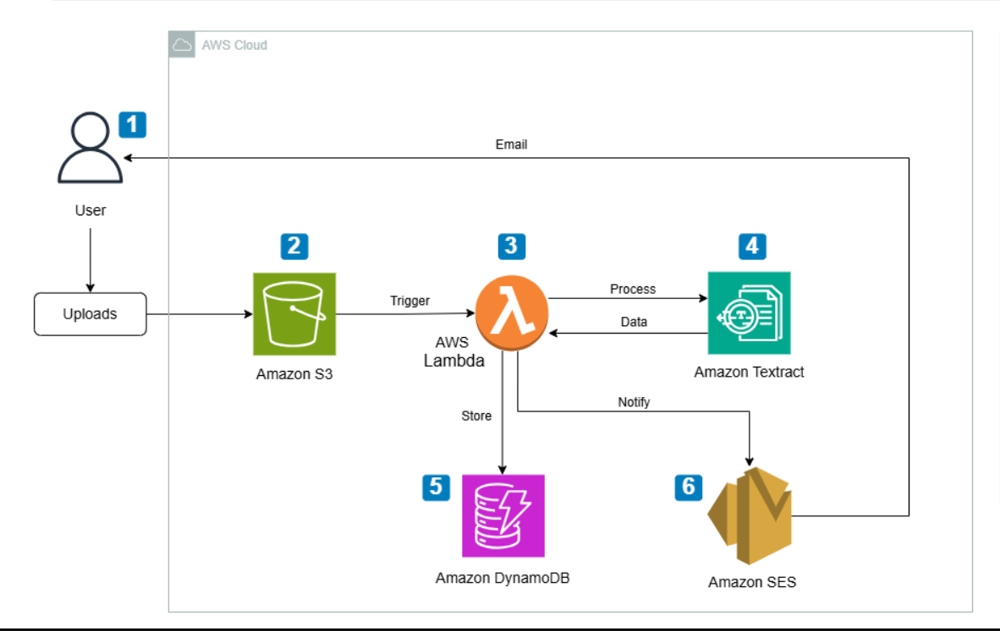

# Serverless Receipt Processor
## 🚀 Overview

- A cloud-native system that automatically extracts, processes, and stores data from receipts using AWS Textract and serverless computing.

- The system eliminates manual data entry and enables scalable, cost-efficient document processing.

## 🧩 Use Case

Businesses and individuals often need to manage large volumes of receipts. Manual processing is inefficient and error-prone.
This project automates receipt extraction and storage using cloud services.

## 🏗️ Architecture

User → API Gateway → AWS Lambda → Textract → DynamoDB → S3

## 🏗️ System Architecture

## ⚙️ Tech Stack

- **Backend:** Python
- **Cloud:** AWS Lambda, Textract, API Gateway, DynamoDB, S3, CloudWatch
- **Tools:** Git, Postman

## ✨ Features

- Automated OCR-based receipt extraction

- Serverless backend processing

- Cloud-based storage

- RESTful API endpoints

- Scalable architecture

## 🔐 Security & Performance

- IAM-based access control

- Serverless scaling

- Optimized AWS cost usage

## 🧪 API Endpoints

| Method | Endpoint        | Description                 |
| ------ | --------------- | --------------------------- |
| POST   | /upload-receipt | Upload and process receipt  |
| GET    | /receipts       | Retrieve processed receipts |

## 📈 Future Enhancements

- Dashboard UI for receipt analytics

- Multi-language OCR support

- Expense categorization using ML

## 📊 Scalability Considerations

- Designed to handle high concurrent users using serverless architecture

- Stateless Lambda functions for horizontal scaling

- DynamoDB for low-latency performance
