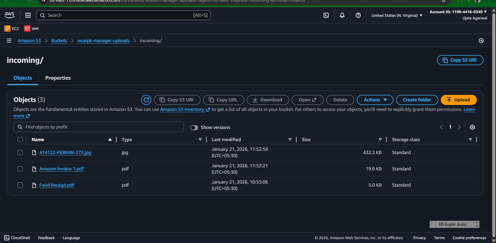
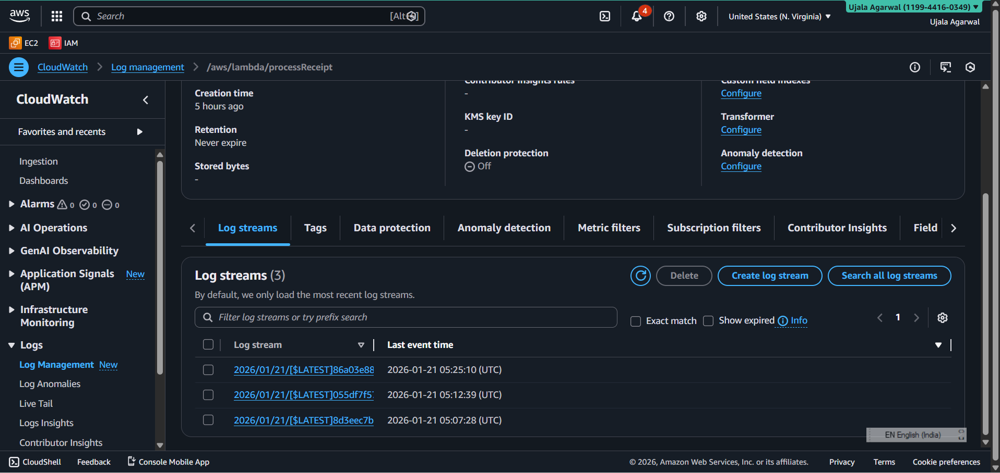
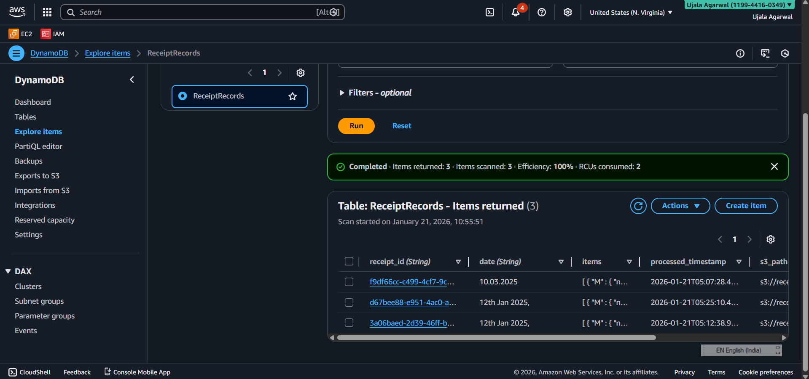
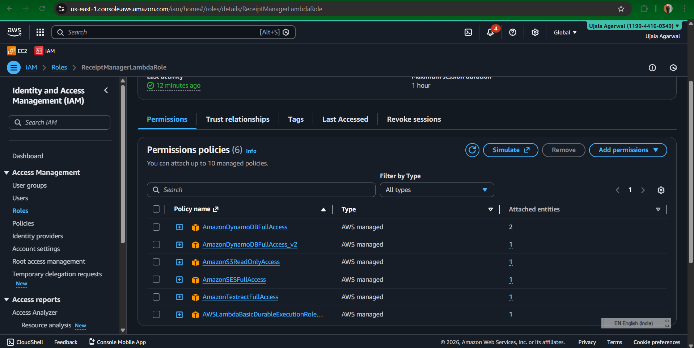
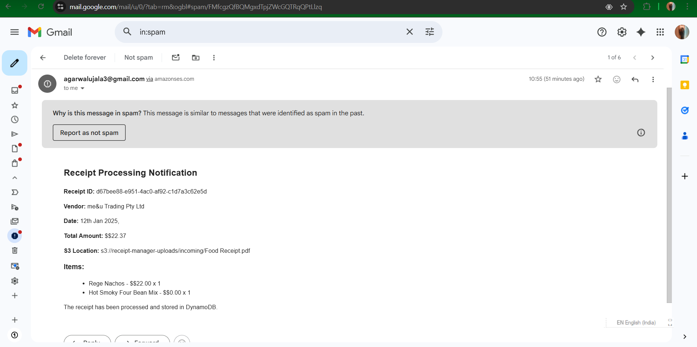

# Automated Receipt Processor

An **AWS serverless project** that automatically processes receipt images uploaded by users, extracts structured data using Amazon Textract, stores the results in **Amazon DynamoDB**, and sends email notifications via **Amazon SES.**

## Overview

Manual receipt handling is time‑consuming and error‑prone. This system automates the entire flow:

- Users upload receipt images

- Text is extracted automatically

- Data is stored in a database

- Confirmation email is sent to the user

All of this is achieved **without managing servers.**

## Architecture

### Workflow Steps

- The user uploads a receipt image to an Amazon S3 bucket.

- The S3 upload event triggers an AWS Lambda function.

- The Lambda function invokes Amazon Textract to extract text from the receipt.

- Amazon Textract returns structured text data to the Lambda function.

- The Lambda function stores the processed receipt data in Amazon DynamoDB.

- The Lambda function sends an email notification to the user using Amazon SES.

### Architecture Diagram

This architecture follows an event-driven, serverless design using AWS managed services.
The system automatically processes receipt images uploaded by users without requiring
any server management, ensuring scalability, reliability, and cost efficiency.

## Screenshots

The following screenshots demonstrate the complete working of the system and validate each AWS service involved:

 **Receipt Uploaded to Amazon S3**

  

 **AWS Lambda Execution Logs (CloudWatch)**

  

 **Extracted Receipt Data Stored in DynamoDB**

 

 **IAM Role Permissions for Lambda**

  

 **Email Notification Sent via Amazon SES**

  

## AWS Services Used

- **Amazon S3:**	Store uploaded receipt images

- **AWS Lambda:**	Process events and orchestrate workflow

- **Amazon Textract:**	Extract text from receipt images

- **Amazon DynamoDB:**	Store structured receipt data

- **Amazon SES:**	Send email notifications

- **IAM:**	Secure access between services

## Lambda Function Logic

- Validate incoming S3 event

- Read receipt image from S3

- Call Amazon Textract (DetectDocumentText)

- Parse and structure extracted data

- Store data in DynamoDB

- Send confirmation email using SES

## Sample Extracted Data

{
  **Receipt ID:** d67bee88 e951-4ac0af92-c1d783c62e5d
  **Vendor:** mellu Trading Pty Ltd
  **Date:** 12th Jan 2025
  **Total Amount:** $322 37
  **53 Location:** s3//receipt manager uploads/incoming/food Receipt.pdf
  **Items:**
  King Nachos $$22.00 x 1
  Hot Smoky Four Bean Mix $50.00 x 1
}

## IAM Permissions Required

Lambda execution role must have access to:

- s3: GetObject

- textract: DetectDocumentText

- dynamodb: PutItem

- ses: SendEmail

## Features

- Fully serverless architecture

- Event‑driven processing

- Scalable and cost‑efficient

- Real‑time email notifications

- Secure AWS best practices

## Use Cases

- Expense management systems

- Accounting automation

- Business invoice processing

- FinTech and SaaS applications

## Learning Outcomes

- Hands‑on AWS serverless design

- Real‑world Lambda + Textract integration

- S3 event triggers

- DynamoDB schema design

- Cloud‑native email notifications

## License

This project is open‑source and available under the **MIT License.**

If you found this project useful, consider giving it a star on GitHub!